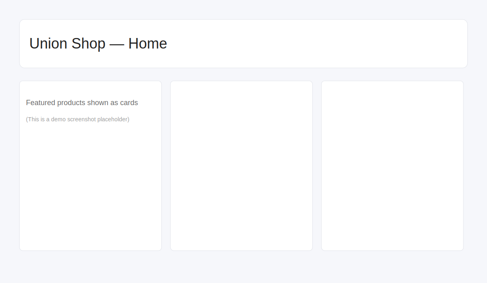
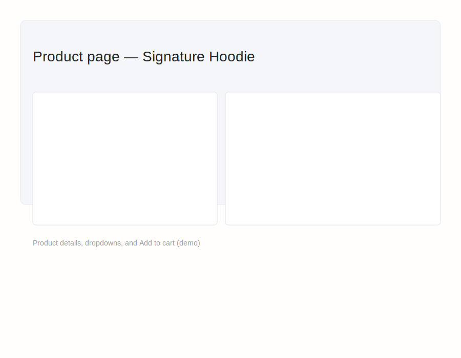
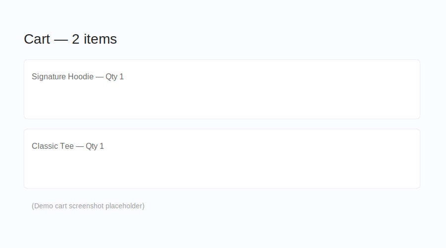

# Union Shop — Student Union Store (Coursework)

This is a Flutter project that demonstrates a small student union web/shop application. It includes product browsing, personalisation, a cart with persistence, and a demo authentication flow.

## Quick start

Requirements
- Flutter (stable) installed — see https://flutter.dev/docs/get-started/install
- Recommended: macOS/Linux/Windows with Flutter tooling

Run locally

```bash
flutter pub get
flutter run -d chrome
```

Run tests

```bash
flutter test
```

CI

This repository includes a GitHub Actions workflow at `.github/workflows/flutter-ci.yml` which runs `flutter analyze` and `flutter test` on pushes and pull requests to `main`.

Demo / Auth notes

- The app includes a demo/local `AuthService` for coursework so the project can be run without external configuration.
- Google sign-in is scaffolded; see `docs/GOOGLE_SIGNIN.md` for steps to configure OAuth client IDs if you want to enable it.

What to change for production

- Replace the demo auth with a production authentication provider (e.g., Firebase Authentication).
- Securely store secrets (do not commit OAuth client secrets).

Tests & grading checklist

- Ensure `flutter test` passes locally.
- Add screenshots to `docs/demo/` if required by your submission.

Contact / Notes

If you'd like, I can add CI badges, screenshots, or a brief demo GIF to `docs/demo/` and finalize the submission.
 
## Screenshots

Below are a few demo screenshots of the app (placeholders included). Replace these with real screenshots from your local run if you prefer.

Home (mobile view):



Product page (with personalisation preview):



Cart page (demo):



# Union Shop — Flutter Coursework

This repository contains the coursework project for students enrolled in the **Programming Applications and Programming Languages (M30235)** and **User Experience Design and Implementation (M32605)** modules at the University of Portsmouth.

## Overview

The Student Union has an e-commerce website, which you can access via this link: [shop.upsu.net](https://shop.upsu.net)

In short, your task is to recreate the same website using Flutter. You must not start from scratch, as you need to begin by forking the GitHub repository that contains the incomplete code. [The getting started section of this document](#getting-started) will explain more. Once you have completed the application, you will submit the link to your forked repository on Moodle for assessment and demonstrate your application in a practical session. See the [submission](#submission) and [demonstration](#demonstration) sections for more information.

⚠️ The UPSU.net link on the navbar of the union website is a link to an external site. This is not part of the application that you need to develop. So ignore the link highlighted below:


## Getting Started

### Prerequisites

You have three options for your development environment:

1. **Firebase Studio** (browser-based, no installation required)
2. **University Windows computers** (via AppsAnywhere)
3. **Personal computer** (Windows or macOS)

Below is a quick guide for each option. For more information, you can refer to [Worksheet 0 — Introduction to Dart, Git and GitHub](https://manighahrmani.github.io/sandwich_shop/worksheet-0.html) and [Worksheet 1 — Introduction to Flutter](https://manighahrmani.github.io/sandwich_shop/worksheet-1.html).

**Firebase Studio:**

- Access [idx.google.com](https://idx.google.com) with a personal Google account
- Create a new Flutter Workspace (choose the Flutter template in the "Start coding an app" section)
- Once the Flutter Workspace is created, open the integrated terminal (View → Terminal) and link this project to your forked GitHub repository by running the following commands (replace `YOUR-USERNAME` in the URL):

  ```bash
  rm -rf .git && git init && git remote add origin https://github.com/YOUR-USERNAME/union_shop.git && git fetch origin && git reset --hard origin/main
  ```

  This command should remove the existing Git history, initialize a new Git repository, add your forked repository as the remote named `origin`, fetch the data from it, and reset the local files to match the `main` branch of your forked repository. After running the above commands, open the Source Control view in Visual Studio Code and commit any local changes. This will create a commit that points to your forked repository. In the terminal you can push the commit to GitHub with:

  ```bash
  git push -u origin main
  ```

  If you're unsure that you're connected to the correct repository, check the remote with:

  ```bash
  git remote -v
  ```

  This should show the URL of your forked repository (`https://github.com/YOUR-USERNAME/union_shop.git` where `YOUR-USERNAME` is your GitHub username).

**University Computers:**

- Open [AppsAnywhere](https://appsanywhere.port.ac.uk/sso) and launch the following in the given order:
  - Git
  - Flutter And Dart SDK
  - Visual Studio Code

**Personal Windows Computer:**

- Install [Chocolatey package manager](https://chocolatey.org/install)
- Run in PowerShell (as Administrator):

  ```bash
  choco install git vscode flutter -y
  ```

**Personal macOS Computer:**

- Install [Homebrew package manager](https://brew.sh/)
- Run in Terminal:

  ```bash
  *** End Patch
  ```
